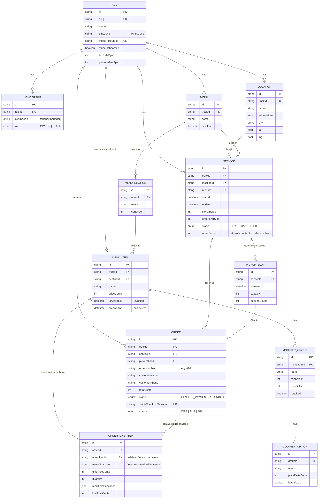

# Entity Relationship Diagram

Generated from `prisma/schema.prisma`. The central entity is **Service** — one
truck, at one location, from one time to another. Menu availability, pickup
slots, capacity, and orders all hang off it (see the README's "The problem"
section for why).

`WebhookEvent` (Stripe webhook idempotency guard, keyed on `stripeEventId`)
has no foreign keys and is omitted above for readability.

## Notes for the writeup

- **Multi-tenancy** is enforced by `truckId` on every tenant-scoped table,
  not by a separate schema per truck. `Membership` is the only link between
  a Clerk user and a truck.
- **Money** is always integer cents (`priceCents`, `totalCents`, etc.) and
  rates are basis points (`taxRateBps`, `platformFeeBps`) — never floats.
- **`OrderLineItem` is a price snapshot.** `menuItemId` can go `null` if the
  menu item is later deleted, but `nameSnapshot` / `unitPriceCents` /
  `modifiersSnapshot` preserve exactly what the customer bought and paid,
  independent of later menu edits.
- **`PickupSlot` rows only exist once a `Service` is published** — they're
  generated from `slotMinutes` / `ordersPerSlot`, not created ad hoc.
